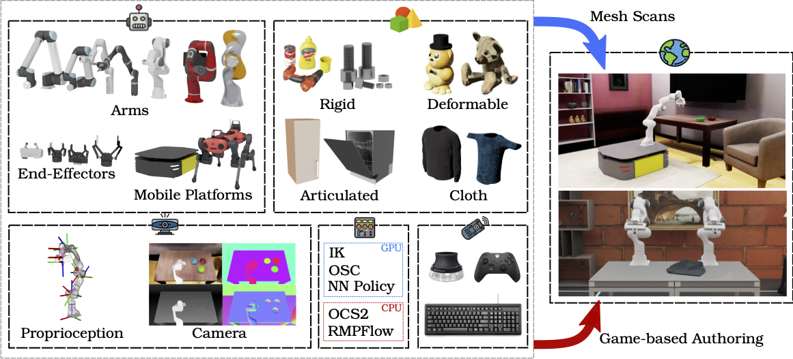

<h1 style="margin: 0; font-size: 1.75rem;">ORBIT: A Unified Simulation Framework for Interactive Robot Learning Environments</h1>

Anonymous Author(s)

[*[Arxiv Paper]()*] [*[Video](https://www.youtube.com/watch?v=DkSMMK5krcA)*]

## Abstract

  We present ORBIT, a unified and modular framework for robotics and robot learning, powered by NVIDIA Isaac Sim.
  It offers a modular design to easily and efficiently create robotic environments with photo-realistic scenes and fast and accurate rigid and soft body simulation. 
  With ORBIT, we provide a suite of benchmark tasks of varying difficulty-- from single-stage cabinet opening and cloth folding to multi-stage tasks such as room reorganization.
  The tasks include variations in objects' physical properties and placements, material textures, and scene lighting.
  To support working with diverse observations and actions spaces, we include various fixed-arm and mobile manipulators with different controller implementations and physics-based sensors.
  ORBIT allows training reinforcement learning policies and collecting large demonstration datasets from hand-crafted or expert solutions in a matter of minutes by leveraging GPU-based parallelization.
  In summary, we offer fourteen robot articulations, three different physics-based sensors, twenty learning environments, wrappers to four different learning frameworks and interfaces to help connect to a real robot.
  With this framework, we aim to support various research areas, including representation learning, reinforcement learning, imitation learning, and motion planning.
  We hope it helps establish interdisciplinary collaborations between these communities and its modularity makes it easily extensible for more tasks and applications in the future.

## Paper Video

<video width="90%" controls>
  <source src="videos/OBRIT_video.mp4" type="video/mp4">
  
Your browser doesn't support HTML5 video. Here is
    a <a href="videos/OBRIT_video.mp4">link to the video</a> instead.

</video>
